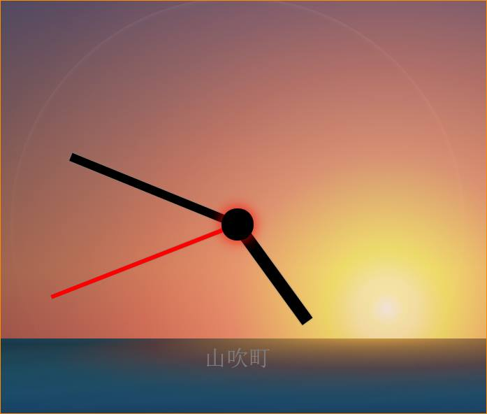

# SunClock

Just a <a href='https://goo.gl/0zQ7OV'>trivial clock</a> with a twist. 
 
I run on my (many years old) SurfaceRT, to make _any_ use of it. 
The only trick the clock knows to do is to to render a sun in the skies on the dial to reflect the exact time of the sunrise/sunset (thanks to <a href='https://github.com/mourner/suncalc'>SunCalc</a>, <a href='https://codepen.io/msaetre/pen/nlsJL'>CSS Sunset Sunrise</a> and <a href='http://www.javascriptkit.com/dhtmltutors/css3clock2.shtml'>the original example</a>.)
